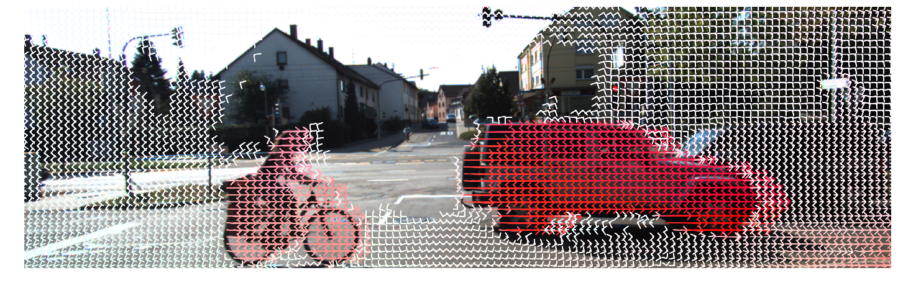
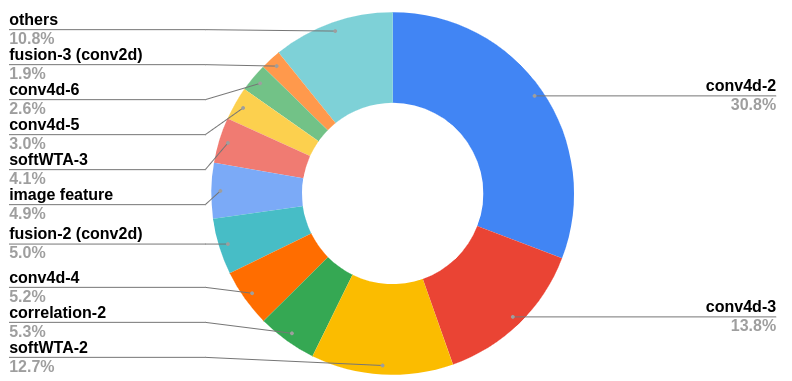

# VCN: Volumetric correspondence networks for optical flow
#### [[project website]](http://www.contrib.andrew.cmu.edu/~gengshay/neurips19flow)


**Requirements**
- python 3.6
- pytorch 1.1.0-1.3.0
- [pytorch correlation module](https://github.com/gengshan-y/Pytorch-Correlation-extension) (optional) This gives around 20ms speed-up on KITTI-sized images. However, only forward pass is implemented. Please replace self.corrf() with self.corr() in models/VCN.py and models/VCN_small.py if you plan to use the faster version.
- [weights files (VCN)](https://drive.google.com/drive/folders/1mgadg50ti1QdwfAf6aR2v1pCx-ITsYfE?usp=sharing) Note: You can load them without untarring the files, see [pytorch saving and loading models](https://pytorch.org/tutorials/beginner/saving_loading_models.html).
- [weights files (VCN-small)](https://drive.google.com/drive/folders/16WvCL1Y5IkCoNmEEEbF_qmZPToMhw9VZ?usp=sharing)

## Pre-trained models
#### To test on any two images
Running [visualize.ipynb](./visualize.ipynb) gives you the following flow visualizations with color and vectors. Note: the sintel model "./weights/sintel-ft-trainval/finetune_67999.tar" is trained on multiple datasets and generalizes better than the KITTI model.





#### KITTI
**This correspondens to the entry on the [leaderboard](http://www.cvlibs.net/datasets/kitti/eval_scene_flow.php?benchmark=flow) (Fl-all=6.30%).**
##### Evaluate on KITTI-15 benchmark

To run + visualize on KITTI-15 test set,
```
modelname=kitti-ft-trainval
i=149999
CUDA_VISIBLE_DEVICES=0 python submission.py --dataset 2015test --datapath dataset/kitti_scene/testing/   --outdir ./weights/$modelname/ --loadmodel ./weights/$modelname/finetune_$i.tar  --maxdisp 512 --fac 2
python eval_tmp.py --path ./weights/$modelname/ --vis yes --dataset 2015test
```

##### Evaluate on KITTI-val
*To see the details of the train-val split, please scroll down to "note on train-val" and run dataloader/kitti15list_val.py, dataloader/kitti15list_train.py, dataloader/sitnellist_train.py, and dataloader/sintellist_val.py.*

To evaluate on the 40 validation images of KITTI-15 (0,5,...195), (also assuming the data is at /ssd/kitti_scene)
```
modelname=kitti-ft-trainval
i=149999
CUDA_VISIBLE_DEVICES=0 python submission.py --dataset 2015 --datapath /ssd/kitti_scene/training/   --outdir ./weights/$modelname/ --loadmodel ./weights/$modelname/finetune_$i.tar  --maxdisp 512 --fac 2
python eval_tmp.py --path ./weights/$modelname/ --vis no --dataset 2015
```

To evaluate + visualize on KITTI-15 validation set,
```
python eval_tmp.py --path ./weights/$modelname/ --vis yes --dataset 2015
```
Evaluation error on 40 validation images : Fl-err = 3.9, EPE = 1.144

#### Sintel
**This correspondens to the entry on the [leaderboard](http://sintel.is.tue.mpg.de/quant?metric_id=0&selected_pass=0) (EPE-all-final = 4.404, EPE-all-clean = 2.808).**
##### Evaluate on Sintel-val

To evaluate on Sintel validation set, 
```
modelname=sintel-ft-trainval
i=67999
CUDA_VISIBLE_DEVICES=0 python submission.py --dataset sintel --datapath /ssd/rob_flow/training/   --outdir ./weights/$modelname/ --loadmodel ./weights/$modelname/finetune_$i.tar  --maxdisp 448 --fac 1.4
python eval_tmp.py --path ./weights/$modelname/ --vis no --dataset sintel
```
Evaluation error on sintel validation images: Fl-err = 7.9, EPE = 2.351


## Train the model
We follow the same stage-wise training procedure as prior work: Chairs->Things->KITTI or Chairs->Things->Sintel, but uses much lesser iterations.
If you plan to train the model and reproduce the numbers, please check out our [supplementary material](https://papers.nips.cc/paper/8367-volumetric-correspondence-networks-for-optical-flow) for the differences in hyper-parameters with FlowNet2 and PWCNet.

#### Pretrain on flying chairs and flying things
Make sure you have downloaded [flying chairs](https://lmb.informatik.uni-freiburg.de/resources/datasets/FlyingChairs.en.html) 
and [flying things **subset**](https://lmb.informatik.uni-freiburg.de/resources/datasets/SceneFlowDatasets.en.html),
and placed them under the same folder, say /ssd/.

To first train on flying chairs for 140k iterations with a batchsize of 8, run (assuming you have two gpus)
```
CUDA_VISIBLE_DEVICES=0,1 python main.py --maxdisp 256 --fac 1 --database /ssd/ --logname chairs-0 --savemodel /data/ptmodel/  --epochs 1000 --stage chairs --ngpus 2
```
Then we want to fine-tune on flying things for 80k iterations with a batchsize of 8, resume from your pre-trained model or use our pretrained model
```
CUDA_VISIBLE_DEVICES=0,1 python main.py --maxdisp 256 --fac 1 --database /ssd/ --logname things-0 --savemodel /data/ptmodel/  --epochs 1000 --stage things --ngpus 2 --loadmodel ./weights/charis/finetune_141999.tar --retrain false
```
Note that to resume the number of iterations, put the iteration to start from in iter_counts-(your suffix).txt. In this example, I'll put 141999 in iter_counts-0.txt.
Be aware that the program reads/writes to iter_counts-(suffix).txt at training time, so you may want to use different suffix when multiple training programs are running at the same time.

#### Finetune on KITTI / Sintel
Please first download the kitti 2012/2015 flow dataset if you want to fine-tune on kitti. 
Download [rob_devkit](http://www.cvlibs.net:3000/ageiger/rob_devkit/src/flow/flow) if you want to fine-tune on sintel.

To fine-tune on KITTI with a batchsize of 16, run
```
CUDA_VISIBLE_DEVICES=0,1,2,3 python main.py --maxdisp 512 --fac 2 --database /ssd/ --logname kitti-trainval-0 --savemodel /data/ptmodel/  --epochs 1000 --stage 2015trainval --ngpus 4 --loadmodel ./weights/things/finetune_211999.tar --retrain true
```
To fine-tune on Sintel with a batchsize of 16, run
```
CUDA_VISIBLE_DEVICES=0,1,2,3 python main.py --maxdisp 448 --fac 1.4 --database /ssd/ --logname sintel-trainval-0 --savemodel /data/ptmodel/  --epochs 1000 --stage sinteltrainval --ngpus 4 --loadmodel ./weights/things/finetune_239999.tar --retrain true
```

#### Note on train-val
- To tune hyper-parameters, we use a train-val split for kitti and sintel, which is not covered by the 
above procedure. 
- For kitti we use every 5th image in the training set (0,5,10,...195) for validation, and the rest for training; while for Sintel, we manually select several sequences for validation.
- If you plan to use our split, put "--stage 2015train" or "--stage sinteltrain" for training.
- The numbers in Tab.3 of the paper is on the whole train-val set (all the data with ground-truth).
- You might find run.sh helpful to run evaluation on KITTI/Sintel.

## Measure FLOPS
```
python flops.py
```
gives

PWCNet:     flops(G)/params(M):90.8/9.37

VCN:        flops(G)/params(M):96.5/6.23

#### Note on inference time
The current implementation runs at 180ms/pair on KITTI-sized images at inference time.
A rough breakdown of running time is: feature extraction - 4.9%, feature correlation - 8.7%, separable 4D convolutions - 56%, trun. soft-argmin (soft winner-take-all) - 20% and hypotheses fusion - 9.5%.
A detailed breakdown is shown below in the form "name-level percentage".



Note that separable 4D convolutions use less FLOPS than 2D convolutions (i.e., feature extraction module + hypotheses fusion module, 47.8 v.s. 53.3 Gflops)
but take 4X more time (56% v.s. 14.4%). One reason might be that pytorch (also other packages) is more friendly to networks with more feature channels than those with large spatial size given the same Flops. This might be fixed at the conv kernel / hardware level.

Besides, the truncated soft-argmin is implemented with 3D max pooling, which is inefficient and takes more time than expected.

## Acknowledgement
Thanks [ClementPinard](https://github.com/ClementPinard), [Lyken17](https://github.com/Lyken17), [NVlabs](https://github.com/NVlabs) and many others for open-sourcing their code.
- Pytorch op counter thop is modified from [pytorch-OpCounter](https://github.com/Lyken17/pytorch-OpCounter)
- Correlation module is modified from [Pytorch-Correlation-extension](https://github.com/ClementPinard/Pytorch-Correlation-extension)
- Full 4D convolution is taken from [NCNet](https://github.com/ignacio-rocco/ncnet), but is not used for our model (only used in Ablation study).

## Citation
```
@inproceedings{yang2019vcn,
  title={Volumetric Correspondence Networks for Optical Flow},
  author={Yang, Gengshan and Ramanan, Deva},
  booktitle={NeurIPS},
  year={2019}
}
```
